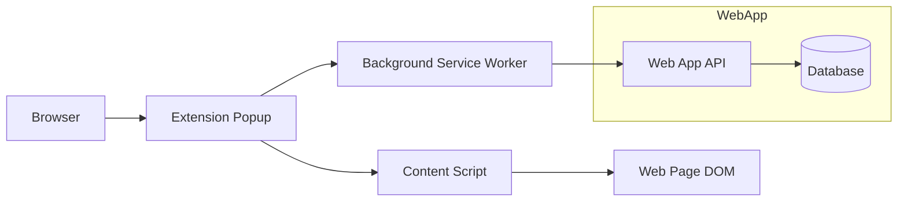
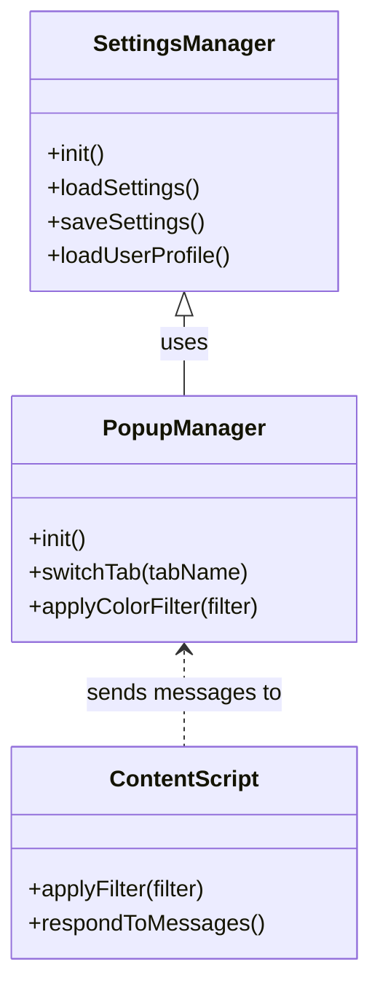
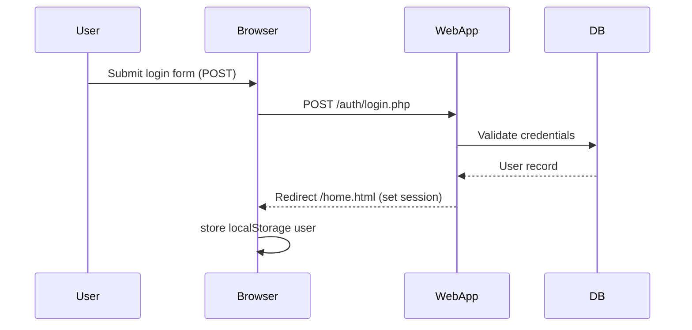
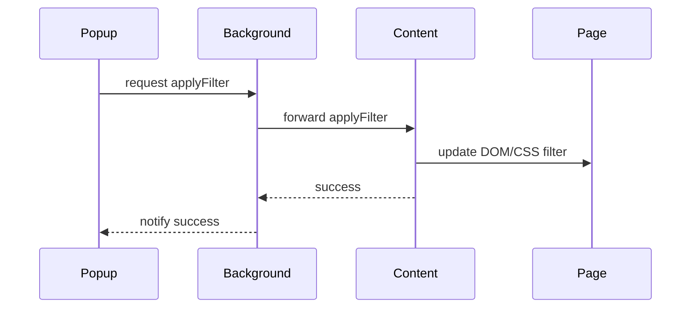

**Accessibility Translator 2.0 — Project Report**

**Author**: Project Team
**Date**: 2025-12-13

---

**Abstract:**
This document details the architecture, design, and implementation of Accessibility Translator 2.0. It includes system overviews, UML diagrams (architecture, class, sequence), data models, API descriptions, extension behavior, and the recent change: clicking the eye logo in the extension popup opens the Accessibility Filters tab.

**Table of Contents**
- Introduction
- System Overview
- Architecture Diagram
- Class Diagram
- Sequence Diagrams
- Data Model
- API Endpoints
- Extension Details (eye-click change)
- Deployment & Testing
- Appendix

---

**Introduction**
Accessibility Translator 2.0 is a web application and Chrome extension pair that provides accessibility features such as text-to-speech, object scanning (OCR), color filters, and voice control. The web app hosts settings, account management and a preferences API. The extension interacts with pages to apply filters, read content, and provide quick accessibility controls.

**System Overview**
- Web Application (PHP/MySQL)
  - Routes: `index.html`, `home.html`, `settings.html`, `auth/*`
  - API: `api/preferences/*`, `api/settings/*`
  - Auth: `auth/register.php`, `auth/login.php`, `auth/session.php`
- Extension (Manifest V3)
  - Popup: `extension/popup.html`, scripts in `extension/scripts/`
  - Content script: `extension/content.js`
  - Background service worker: `extension/background.js`

**Architecture Diagram (Mermaid)**



**Class Diagram (Mermaid)**



**Sequence Diagram — Login Flow**



**Sequence Diagram — Apply Color Filter (Extension)**



**Data Model (simplified)**
- users (id, name, email, password_hash, created_at)
- preferences (id, user_id, preferences_json, last_updated)

**API Endpoints**
- `api/preferences/get.php` — GET, returns preferences for logged-in user
- `api/preferences/update.php` — POST, accepts JSON preferences and stores per-user
- `auth/login.php` — POST, login (AJAX returns JSON or redirect for form)
- `auth/register.php` — POST, register new user

**Extension Details — Eye Logo Change**
- File changed: `extension/scripts/popup.js`
- Behavior added: clicking the header eye logo (element `.logo-gradient`) now switches the popup view to the "Accessibility Filters" tab. This supports mouse and keyboard (Enter/Space) activation for accessibility.

Snippet of the change:

```javascript
// Header logo (eye) click: jump to Filters page
const logo = document.querySelector('.logo-gradient');
if (logo) {
  logo.setAttribute('role', 'button');
  logo.setAttribute('tabindex', '0');
  logo.addEventListener('click', () => this.switchTab('filters'));
  logo.addEventListener('keydown', (e) => {
    if (e.key === 'Enter' || e.key === ' ') {
      e.preventDefault();
      this.switchTab('filters');
    }
  });
}
```

**Styling & Layout**
- This Markdown report includes Mermaid diagrams to represent UML. The attached PDF template was used as a visual guideline; Markdown/Markdown+Mermaid approximates the layout and diagrams.
- If you require pixel-perfect reproduction of the PDF (fonts, exact color, page layout), I can generate an HTML/CSS version of the report and produce a PDF render that closely matches the original template. Let me know and I will generate an HTML+CSS report and a rendered PDF.

**Deployment & Testing**
- To preview extension changes: load the `extension/` directory as an unpacked extension in Chrome and open the popup. Click the eye logo to confirm it switches to "Accessibility Filters".
- To run quick smoke tests for web app endpoints: use `curl` or Postman against `auth/session-status.php` and `api/preferences/get.php` while logged in.

**Appendix — Diagrams Raw (Mermaid)**
- All diagrams are included above in mermaid blocks. You can render them using any mermaid-compatible renderer (VS Code Mermaid preview, mermaid.live, or static renderers).

---

If you'd like:
- I can produce an HTML+CSS version of the report that more closely matches the PDF template visually and generate a PDF snapshot.
- I can change which tab the eye icon opens (currently set to `filters`) to another tab or to a separate extension page; tell me the desired target.
- I can also produce PNG/SVG exports of the mermaid diagrams and add them to the repo.

